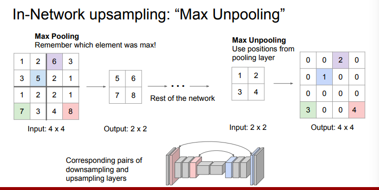
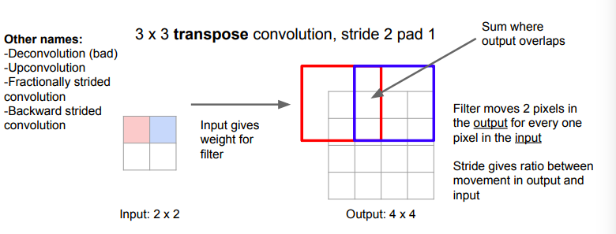

# ObjectDetectionNotes
This is a repository for object detection notes and detailed implementation explanation with English and Chinese version.   

# Faster RCNN

See for more details in [Faster RCNN](fasterrcnn.md)

# YOLO 

See for more details in [YOLO Description](YOLO.md). 

# SSD

See for more details in [SSD Description](ssd.md)

## New 2019 Detection Methods

There are optimization in backbone, IoU,NMS, anchor, one shot learning/zero shot learning, etc.

- backbone：ResNet, XCeption, DenseNet, FPN, DeNet, R-CNN, PANet, etc
- Optimization: unit box, IoU-Net, etc.
- Loss based optimization: L1, L2, focal loss, etc.
- NMS based: Soft-NMS, Softer-NMS, Relation Network, ConvNMS, NMS Network, Yes-Ne, etc.
- Anchor-based: sliding window, region poporal network(RPN), CornetNet, meta-anchor, etc.
- One-shot-learning, zero shot learning. FSAF

## Segmentation 

Segmentation is not part of object detection, segmentation is pixel level accuracy. 

There are many kinds of segmentation, semantic segmentation, instance segmentation and panoptic segmentation. 

Semantic segmentation will classify every pixel into specific category. But will not divide a group of the same objects into different instance. All of them will regard as the same class. Instance segmentation is a combo of object detection and semantic segmentation(the back ground is not considered). Panoptic segmentation is a combo of instance segmentation and id assignment.

Segmentation is a kind of structure learning, so I think GAN may be a excellent tool for segmentation.

### Semantic Segmentation 

Label every pixel as one category. The most important paper is FCN. To resume the size of the output images, there is up-sampling and feature map fusion to reserve the position information. U-Net uses up-convolution to reserve the position information and resume the structure of the images. SegNet utilizes the image coordinate to reserve the position, when inverse-pooling, the data is resumed to responding position. And other position is regard as 0. PSPNet uses pyramid poolong to get different scale of perception field.

For the up-pooling, the following image is an excellent explanation:

For the up-conv: 

All in all, in semantic segmentation, there are following optimization:

- All convolution operation, no fully connected layer. 
- Perception field change: low layer has good of feature and position, higher layer has good perception of semantic information. So there should be good feature map fusion to get both advantages of these. 
- Cosider the pixel relationship with CRF.

### Instance Segmentation 

The nets include SDS, HyperColumns, CFM, Deep&Sharp Mask, MNC, ISFC, FCIS, SIS, Mask RCNN, PAN.

Hypercolumns: detect the ROI then extran feature maps then fuse all feature maps for SVM classification.

CFM: using RCNN and SDS combo for object detection then pixel classification.

NMS: RPN for region proposal, ROI warping pooling for mask inference, then the final layer for mask classification.

ISFCN: use two branches for instance segmentation, one is semantic segmentation, the other is instance-sensitive score maps to get this is a object or not. There are FICS and SIS.

Mask RCNN: faster RCNN and use the same feature map for mask. 

### Panoptic Segmentation 

Combo of semantic segmentation and instance segmentation. Every pixel has a label and belongs to one instance.

The simplest method we can use instance segmentation, then regard the background as another instance. :)

Excellent Ref:

- [Detection conclusion](https://zhuanlan.zhihu.com/p/27546796)
- [New Object Detection 2019](https://zhuanlan.zhihu.com/p/59398728)
- [Semantic Segmentation](https://zhuanlan.zhihu.com/p/37618829)
- [Up Sampling in CNN](http://cs231n.stanford.edu/slides/2017/cs231n_2017_lecture11.pdf)
- [Semantic Segmentation](https://zhuanlan.zhihu.com/p/37801090)
- [Panoptic Segmentation](https://blog.csdn.net/zziahgf/article/details/79063398)
- [Segmentation Conclusion](https://www.jianshu.com/p/5557baff72cf)
- [Instance Segmentation](https://blog.csdn.net/qq_39295044/article/details/79796663)