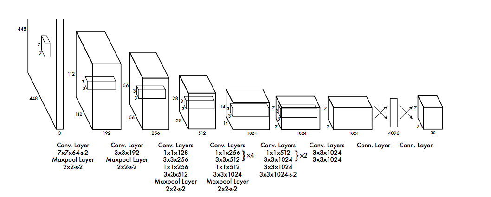
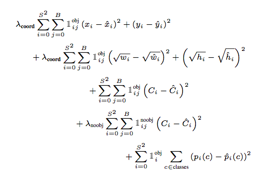

# YOLO 

## Training Data Processing

The input image is divided into SxS grid, and every grid is responsible for detect the objects which is the center of the object in this grid. 

The prediction label is classification and bounding box. With size $S*S(B*5 + C)$ (In YOLO2, there is S is 13) . B is 2 in the YOLO1, and 5 stands for width w and height h from the center(normalized with [0,1] with image height and image width), localization (x,y) far from the center position, also normalized to [0,1]. Confidence c is about the object probability got by project classification probability and IOU between prediction and truth.  YOLO will detect one bounding box by its IOU. (In YOLO2, there is anchor box K-means clustering in training data)

## YOLO Network 

1x1 network: used for cross channel information fusion.

## YOLO Loss Design

YOLO loss is relative to its prediction, we can guess that there is coordinate regression loss and center coordinate regression loss, and for classification, there is classification probability loss(cross entropy). The confidence prediction has no difference in big object and smal oject, this will make it detect samll objects worser. (Although there is square root of width and height, but it will work in some degree)

The total loss showing below:

## Comparing with faster rcnn

- Bounding box regression and classification are in one network. There is no distinct proposal parts in YOLO. Faster rcnn uses RPN and Fast RCNN/RCNN use selective search. YOLO can get the classification, bounding box and confidence at one network.
- Bothe methods use anchor to get different bounding box initialization. So there is a preprocessing to get candidate anchors.

## Result

YOLO: 63.4%, 45 fps

Fast YOLO: 52.7%, 155fps

## YOLO advantages and disadvantages

- Fast than Faster RCNN 
- Background detection (FalsePositive) lower than Faster RCNN. As the YOLO using the whole images for regression, the Faster RCNN utilizes region proposal network.
- Higher generalization (can be used in artificial images) 
- Dis: recall is lower than faster rcnn and bounding box is not accurate as faster rcnn. Not good at detecting small objects.

Reference documents:

- [YOLO Website](https://pjreddie.com/publications/)
- [YOLO详解](https://zhuanlan.zhihu.com/p/25236464)
- [YOLO Confidence](https://zhuanlan.zhihu.com/p/25045711)
- [YOLO C++ Implementation](https://github.com/AlexeyAB/darknet)
- [YOLO TensorRT](https://github.com/NVIDIA-AI-IOT/deepstream_reference_apps)
- [YOLO Loss explanation](https://blog.csdn.net/briblue/article/details/84794511)
- [YOLO2 Anchor](https://blog.csdn.net/mieleizhi0522/article/details/79887066) 
- [YOLO Blog](https://blog.csdn.net/u014380165/article/details/72616238)

