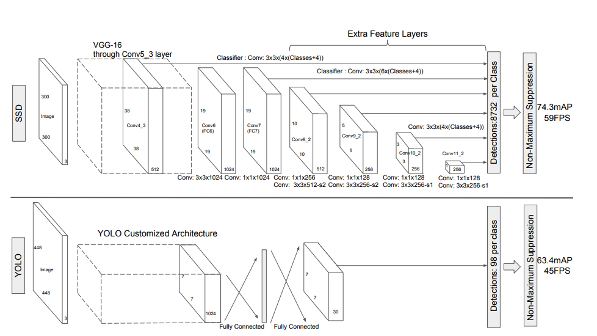
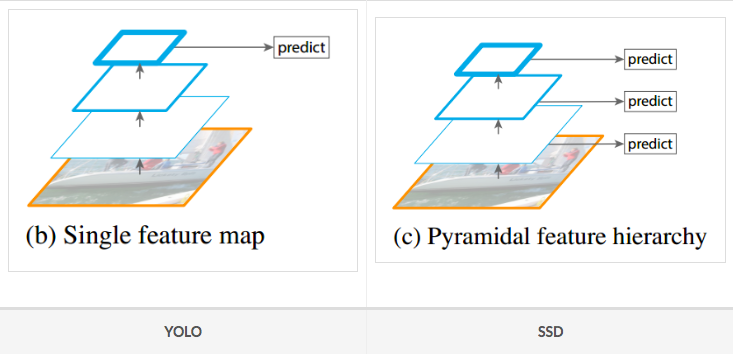
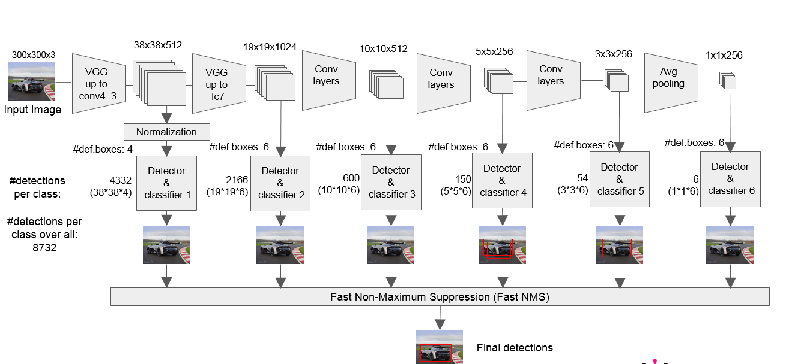
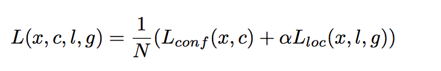
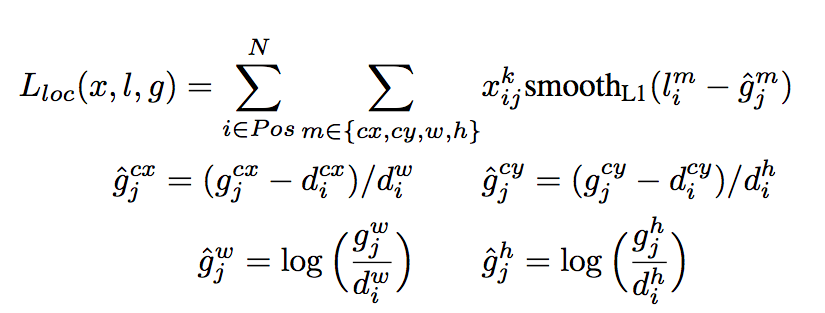
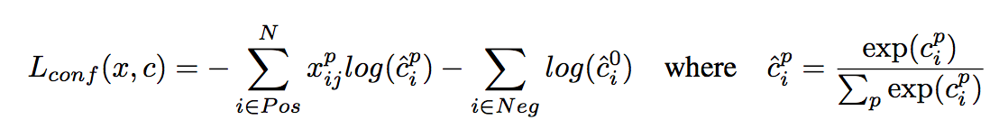

# SSD: Sinle Shot Multibox Detection

## Network 

Using VGG-net as backbone and more convolution layers for ojbect detection.

The prediction of bounding box of YOLO and SSD can be seen below: (YOLO is using the last layer for bounding box prediction; SSD is using different feature map to bounding box prediction.)

The whole architecture of SSD can be shown below:

The last six feature map will be used for object detection, then the whole results will be merged with post processing.

## Loss Design 

The total loss contains confidence loss and localization loss.

## Training Skills

- Default box and ground truth matching: groundtruth box will match the biggest jaccard overlap default boxes. Every default boxes is matched with ground truth with ovelapped more than 0.5.
- Hard negative mining: use fixed negative samples. 
- Data augmentation

## Difference with YOLO

- Using multi-scale feature map for detection: wih this the small objects can be detected in lower layer; 
- Using convolution layer for detection not fully connected layers. 
- Default boxes and aspect ratio: in feature map, every response should be k boxes. So there is about $(C+4)*k*m*n$ default boxes.

## Advantage and Disadvantage

- Speed likes YOLO, and precision likes Faster RCNN
- Not sensitive to small objects and like Faster RCNN, there is anchor.
- Using multi-scale thinking and extract different layers for object prediction. Lower level is for small objects and higher level is for big objecs.

Ref:

- [SSD paper](https://arxiv.org/pdf/1512.02325.pdf)

- [SSD Code](https://github.com/weiliu89/caffe/tree/ssd)

- [SSD Explanation](https://zhuanlan.zhihu.com/p/32929487)

- [SSD Issue](https://blog.csdn.net/u010167269/article/details/52563573)

- [Training skills](https://blog.csdn.net/u013989576/article/details/73439202)

- [SSD Explanation2](https://zhuanlan.zhihu.com/p/33544892)

- [Good SSD Explanation](https://arleyzhang.github.io/articles/786f1ca3/)

  